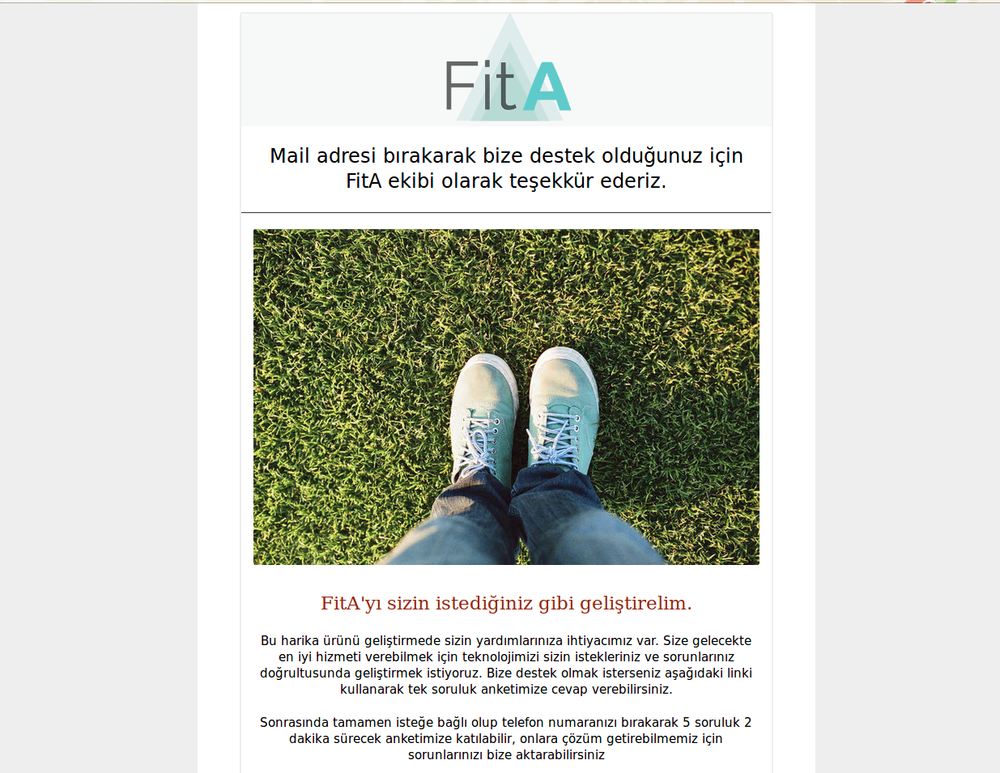

# fita-html-email
Html email template

### How to create an html e-mail?

1. Create your e-mail like you would create a web page.
2. Delete anything other than body and head tags.
3. Use an external tool to inline all your css.
4. Copy your code. Open Gmail, new e-mail, right click text box, inspect, paste the code.
5. Do not send it right away. Save it as a draft and check if it works, than you can send it.

email.html is the file you might want to edit

